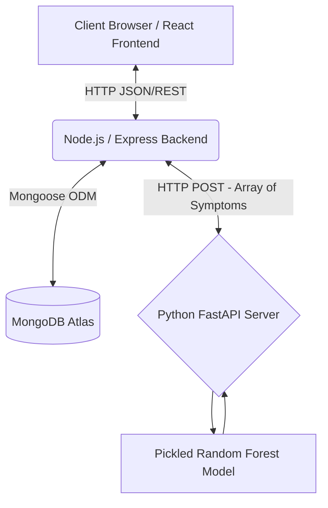
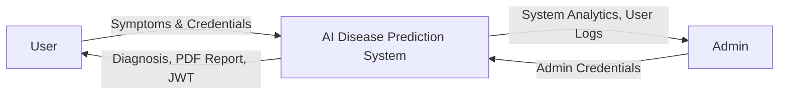
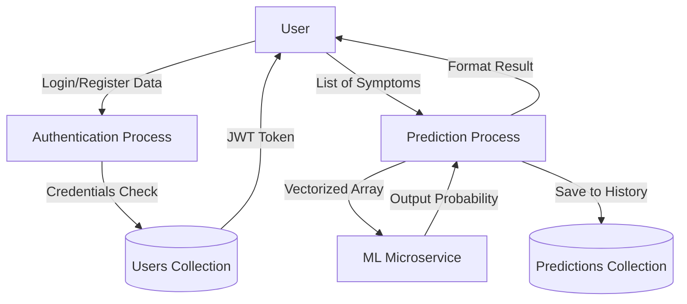
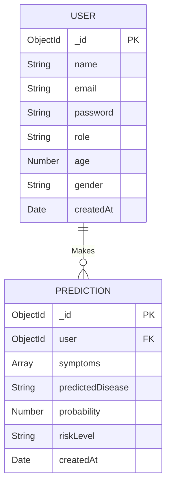
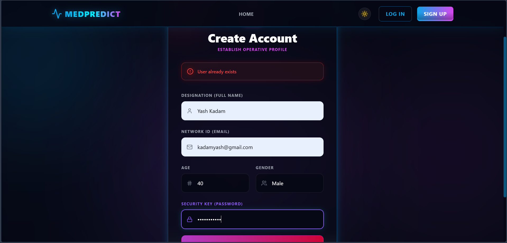

# PROJECT REPORT

**PROJECT TITLE:** AI-Based Disease Prediction & Health Risk Assessment System

**SUBMITTED BY:**  
[Your Name / Student Name]  
[Your Roll Number / Student ID]  

**SUBMITTED TO:**  
[Professor Name / Guide Name]  
[Department Name / University Name]  
[Year / Semester]

---

<br><br><br><br>

## DECLARATION
I hereby declare that this project report entitled **"AI-Based Disease Prediction & Health Risk Assessment System"** submitted in partial fulfillment of the requirements for the degree of [Your Degree] in [Your Branch/Specialization] from [Your University/College Name] is an authentic record of my own work carried out under the guidance of [Guide's Name]. The matter embodied in this report has not been submitted by me for the award of any other degree or diploma to any other university or institute.

**Date:** .........................  
**Signature:** .........................  

<br><br>

## CERTIFICATE
This is to certify that the project entitled **"AI-Based Disease Prediction & Health Risk Assessment System"** has been successfully completed by **[Your Name]**, student of [Your Course/Degree] during the academic year [Year]. This report is the record of authentic work carried out by them under our supervision and guidance.

**Project Guide:** .........................  
**Head of Department:** .........................  

<br><br>

## ACKNOWLEDGEMENTS
I would like to express my special thanks of gratitude to my project guide [Guide's Name] as well as our principal [Principal's Name] who gave me the golden opportunity to do this wonderful project on the topic "AI-Based Disease Prediction & Health Risk Assessment System", which also helped me in doing a lot of research and I came to know about so many new things. I am really thankful to them.

Secondly, I would also like to thank my parents and friends who helped me a lot in finalizing this project within the limited time frame.

---

# TABLE OF CONTENTS
1. [Abstract](#1-abstract)
2. [Chapter 1: Introduction](#chapter-1-introduction)
3. [Chapter 2: Literature Review](#chapter-2-literature-review)
4. [Chapter 3: System Requirements Specification (SRS)](#chapter-3-system-requirements-specification)
5. [Chapter 4: System Architecture and Design](#chapter-4-system-architecture-and-design)
6. [Chapter 5: Technologies and Tools Used](#chapter-5-technologies-and-tools-used)
7. [Chapter 6: Implementation Details](#chapter-6-implementation-details)
8. [Chapter 7: Source Code & Algorithms](#chapter-7-source-code--algorithms)
9. [Chapter 8: Database Design (MongoDB Atlas)](#chapter-8-database-design)
10. [Chapter 9: Testing and Quality Assurance](#chapter-9-testing-and-quality-assurance)
11. [Chapter 10: Screenshots and User Interface](#chapter-10-screenshots-and-user-interface)
12. [Chapter 11: Future Enhancements](#chapter-11-future-enhancements)
13. [Chapter 12: Conclusion](#chapter-12-conclusion)
14. [References](#references)

---

# 1. ABSTRACT
The "AI-Based Disease Prediction & Health Risk Assessment System" is an innovative, full-stack Web Application designed to evaluate potential health risks and predict diseases based on user-specified symptoms. As healthcare shifts towards preventative and digital-first methodologies, the project bridges the gap between modern Web Technologies (specifically the MERN Stack) and Machine Learning (Python/Scikit-Learn/FastAPI) to deliver a seamless, responsive, and robust Health Diagnostics platform. 

By analyzing historical medical datasets utilizing a Random Forest Classifier algorithms, the system offers instantaneous, probabilistic disease predictions. It then goes a step further by outlining preventative measures, lifestyle simulations ("What-if" scenarios), medical roadmap planning, and specialist recommendations. Administrators are provided with an elaborate Node Control Dashboard to view all active nodes, run statistical analytics across the application, and oversee data ingestion via MongoDB Atlas.

---

# CHAPTER 1: INTRODUCTION

### 1.1 Background of the Study
In a rapidly digitizing healthcare era, prompt and early disease detection significantly reduces mortality rates, emotional toll, and overarching healthcare expenditures. Despite advancements in medical science, access to immediate preliminary health diagnostics is often restricted by geographical constraints or resource scarcity, particularly in developing sectors. 

### 1.2 Problem Statement
Traditional symptom checkers on the internet often rely on rigid IF-THEN rules or static decision trees. They lack dynamic accuracy, fail to scale with new medical data, and do not provide a confident probabilistic model. Furthermore, contemporary platforms suffer from a lack of engaging User Interface (UI) design, rendering the patient experience anxiety-inducing rather than reassuring. A scalable, intelligent, probability-weighted Machine Learning model integrated into a pristine web application is required.

### 1.3 Objectives of the Project
The primary objectives of the proposed system are:
1. **Machine Learning Accuracy:** Train a fast and accurate classification ML Model (Random Forest and Decision Trees) capable of digesting an extensive array of categorical symptom inputs to output highly accurate disease classifications.
2. **Immersive User Interface:** Create an aesthetically engaging, futuristic, highly responsive Frontend using React, Vite, Framer Motion, and Tailwind CSS utilizing "Glassmorphism" concepts.
3. **Secure API Gateway:** Build a secure RESTful Backend API using Node.js and Express.js to orchestrate authentication, session management, and routing to the Machine Learning microservice.
4. **Cloud Database Architecture:** Persist user profiles, administration credentials, and historical prediction data in a secure NoSQL Cloud Database (MongoDB Atlas).
5. **Role-Based Analytics:** Offer comprehensive analytical capabilities for system Administrators via specialized dashboards featuring real-time charting (Recharts) and data tracking.

### 1.4 Scope of the Project
The current scope covers preliminary health screening. It assesses over 40 unique symptoms mapping to more than 15 unique disease classifications. It allows users to register, login securely, perform a health scan, generate a PDF report of their health, and simulate how lifestyle changes (diet, exercise, smoking cessation) can theoretically lower their risk probabilities.

### 1.5 Motivation
Personal health tracking is becoming ubiquitous. Empowering users with Artificial Intelligence to gain insight into their physiological symptoms ensures they can make informed decisions regarding when to seek professional medical intervention.

---

# CHAPTER 2: LITERATURE REVIEW

### 2.1 Overview of Healthcare Informatics
Healthcare informatics is the intersection of information science, computer science, and healthcare. Transitioning from paper records to electronic health records (EHR) paved the way for computational analysis of patient data.

### 2.2 Machine Learning in Medical Diagnosis
Machine Learning algorithms, particularly supervised learning models like Support Vector Machines (SVM), Naive Bayes, and Random Forest, have been extensively researched for disease prediction. 
* **Naive Bayes:** Often used for its simplicity in calculating probabilities based on Bayes' theorem.
* **Decision Trees:** Provide transparent, interpretable paths linking symptoms to diseases.
* **Random Forest:** Chosen for this project due to its ensemble learning method. It constructs a multitude of decision trees at training time, correcting the habit of specific decision trees overfitting to their training set. This drastically increases accuracy dealing with highly dimensional symptom data.

### 2.3 Web Application Architectures
The evolution of web applications has moved from monolithic Server-Side Rendered (SSR) architectures to decoupled microservices. The MERN stack (MongoDB, Express, React, Node) decoupled the frontend and backend, allowing asynchronous data fetching (AJAX/Fetch/Axios) without refreshing the webpage. The introduction of Python-based microframeworks like FastAPI has allowed seamless integration between JavaScript-heavy web applications and Python-heavy Data Science pipelines.

---

# CHAPTER 3: SYSTEM REQUIREMENTS SPECIFICATION

### 3.1 Hardware Requirements
* **Processor:** Intel Core i5 / AMD Ryzen 5 or equivalent (Minimum).
* **RAM:** 8 GB (16 GB Recommended for running simultaneous servers).
* **Storage:** 256 GB SSD (Minimum 500 MB free space for Node modules and Python environment).
* **Network:** High-speed internet connection for API requests and MongoDB Atlas connectivity.

### 3.2 Software Requirements
* **Operating System:** Windows 10/11, macOS, or Linux.
* **Runtime Environments:** 
  * Node.js (v18.x or above) for Backend and Frontend.
  * Python (v3.9 or above) for Machine Learning Server.
* **Database:** MongoDB Atlas (Cloud Cluster).
* **Development Tools:** Visual Studio Code (VS Code), Postman (for API testing).
* **Web Browser:** Google Chrome, Mozilla Firefox, or Microsoft Edge.

### 3.3 Functional Requirements
* **User Authentication:** 
  * The system must allow users to register with Name, Email, Age, Gender, and Password.
  * The system must encrypt passwords using BCrypt.
  * The system must issue a JSON Web Token (JWT) upon successful login for session persistence.
* **Prediction Engine:**
  * The system must allow authenticated users to select multiple symptoms from a dropdown list.
  * The system must transmit these symptoms to the ML server.
  * The system must return the predicted disease, probability score, risk level, precautions, and specialist recommendations.
* **Administrative Capabilities:**
  * The system must identify 'Admin' users from 'Standard' users.
  * Admins must have access to global statistics: Total Users, Total Predictions, and Disease Frequencies.
  * Admins must view a tabular list of recent diagnostic records mapped to users.
* **PDF Report Generation:**
  * Users must be able to export their diagnostic results into a professionally formatted PDF document.

### 3.4 Non-Functional Requirements
* **Performance:** The ML prediction must return results to the user interface in under 2 seconds.
* **Security:** Use HTTPS, environment variables (`.env`) for sensitive URIs, and JWT for route guarding.
* **Usability:** The interface must be responsive (mobile, tablet, desktop) and intuitive, utilizing smooth transitions and clear error messages.
* **Reliability:** Graceful error handling (e.g., if the ML server is unreachable, the Node backend will notify the user correctly instead of crashing).

---

# CHAPTER 4: SYSTEM ARCHITECTURE AND DESIGN

### 4.1 System Architecture Block Diagram
The platform is segregated into three independent, communicating microservices.



### 4.2 Data Flow Diagrams (DFD)

#### Level 0 DFD (Context Diagram)


#### Level 1 DFD


### 4.3 Entity Relationship Diagram (ERD)


### 4.4 UI/UX Design Approach
The design language implemented is "Neon Cyberpunk / Glassmorphism". This involves:
* Heavy use of dark backgrounds (`#050814`) with vibrant neon accents (Cyan, Pink, Violet).
* Glass panels using CSS `backdrop-filter: blur(x)` and border-opacities to create depth.
* Micro-animations using `framer-motion` for button hovers, spring-loaded page transitions, and dynamically filling Recharts.

---

# CHAPTER 5: TECHNOLOGIES AND TOOLS USED

### 5.1 Frontend Technologies
* **React.js (v19.x):** A JavaScript library for building user interfaces based on UI components.
* **Vite:** A next-generation frontend tooling utility that serves code via native ES modules, ensuring instant server start and lightning-fast Hot Module Replacement (HMR).
* **Tailwind CSS:** A utility-first CSS framework packed with classes like `flex`, `pt-4`, `text-center` and `rotate-90` that can be composed to build any design, directly in markup.
* **Framer Motion:** A production-ready motion library for React utilized for orchestrating highly complex SVG and DOM animations.
* **Recharts:** A composable charting library built on React components to display Analytics (Pie Charts, Bar Charts).
* **jsPDF:** A client-side JavaScript PDF generation library used for generating medical reports entirely without server-side rendering.

### 5.2 Backend Technologies
* **Node.js:** A JavaScript runtime built on Chrome's V8 JavaScript engine, operating asynchronously.
* **Express.js:** A minimal and flexible Node.js web application framework that provides a robust set of features for web and mobile applications (Routing, Custom Middleware).
* **JSON Web Token (JWT):** An open standard (RFC 7519) that defines a compact and self-contained way for securely transmitting information between parties as a JSON object.
* **Bcrypt:** A password-hashing function designed by Niels Provos and David Mazières, utilized to secure user credentials before storing them in MongoDB.

### 5.3 Database
* **MongoDB Atlas:** A fully-managed cloud database service for modern applications. It is NoSQL, meaning data is stored in flexible, JSON-like documents, making it extremely easy to handle arbitrary arrays of symptoms.
* **Mongoose:** An Object Data Modeling (ODM) library for MongoDB and Node.js. It manages relationships between data, provides schema validation, and is used to translate between objects in code and the representation of those objects in MongoDB.

### 5.4 Machine Learning and Python Service
* **Python 3.9+:** The core programming language for the intelligence layer.
* **Scikit-Learn:** The most useful and robust library for machine learning in Python. It provides a selection of efficient tools for machine learning and statistical modeling including classification.
* **FastAPI:** A modern, fast (high-performance), web framework for building APIs with Python based on standard Python type hints.
* **Pandas & NumPy:** Libraries utilized for data manipulation, formatting the `.csv` datasets, and shaping multi-dimensional arrays for the Machine Learning model.
* **Pickle:** Used to serialize and de-serialize a Python object structure, allowing the pre-trained ML model to be saved as `disease_model.pkl` and loaded into the API memory instantaneously.

---

# CHAPTER 6: IMPLEMENTATION DETAILS

### 6.1 Database Configuration and Setup
Instead of installing a local MongoDB instance, the application utilizes MongoDB Atlas. 
1. An organization and cluster (`Cluster0`) was generated.
2. IP Whitelisting was disabled (`0.0.0.0/0`) to allow remote backend requests.
3. A Database User (`disease_prediction_admin`) was created alongside a highly secure, auto-generated alphanumeric password.
4. The MongoDB URI string was placed securely inside the Backend's `.env` repository to ensure credential safety.

### 6.2 The Unified Start Script (Concurrently)
Managing three independent servers (Vite, Express, FastAPI) during development is arduous. A root `package.json` was implemented utilizing the `concurrently` package. 
* Command: `npm run dev` 
* Action: Successfully binds three separate terminal instances together, executing `npm run dev` for the frontend, `npm run dev` for the backend, and `python app.py` for the ML Model asynchronously.

### 6.3 Machine Learning Pipeline
1. **Data Ingestion:** A massive historical array of patients, their binary listed symptoms (1/0), and the resulting disease diagnosis (`disease_dataset.csv`).
2. **Preprocessing:** Extracting feature matrices ($X$) focusing on symptoms, and extracting target vectors ($y$) indicating diseases.
3. **Training:** 80% of data utilized for training, 20% for testing using `train_test_split`.
4. **Model Fitting:** `RandomForestClassifier()` is fitted. It maps probabilities for every specific output class.
5. **Artifact Saving:** Generating `disease_model.pkl` and `symptoms_list.json` to be utilized by the FastAPI server in production.

### 6.4 The Prediction Workflow
1. The user navigates to `localhost:5173/predict`.
2. The React Frontend fetches the available `symptoms_list.json` from the Python Server on HTTP Port `8000`.
3. The user utilizes a Multi-Select searchable dropdown to pick symptoms (e.g., `high fever`, `headache`).
4. Clicking "Initialize Analysis" triggers an Axios POST request to the Node.js Backend on HTTP Port `5000` (`/api/predict`) containing the user's JWT Token and the Array of Symptoms.
5. Node.js pauses, formats the data, and acts as a proxy, sending the Array to the Python Server `8000`.
6. Python unpickles the ML Model, parses the string array into a Binary Matrix of 0s and 1s, passes it to `model.predict_proba()`, calculates the highest accuracy disease, and formats a JSON response containing the disease Name, Probability, Risk Level, Precautions, and Specialist.
7. Python replies to Node.js.
8. Node.js takes the payload, attaches the `req.user._id` from the decoded JWT Token, and saves a brand new Document into the MongoDB Atlas `Predictions` Collection.
9. Node.js replies back to the React Frontend.
10. React receives the data and updates the React State (`setResult(res.data)`), causing the DOM to execute Framer Motion animations to reveal the Diagnostic PDF Report Panel.

---

# CHAPTER 7: SOURCE CODE & ALGORITHMS

### 7.1 Server Configuration (Backend `server.js`)
```javascript
import express from 'express';
import mongoose from 'mongoose';
import cors from 'cors';
import dotenv from 'dotenv';
import authRoutes from './routes/auth.js';
import predictRoutes from './routes/predict.js';
import adminRoutes from './routes/admin.js';

dotenv.config();
const app = express();

app.use(cors());
app.use(express.json());

app.use('/api/auth', authRoutes);
app.use('/api/predict', predictRoutes);
app.use('/api/admin', adminRoutes);

const PORT = process.env.PORT || 5000;
const MONGO_URI = process.env.MONGO_URI;

mongoose.connect(MONGO_URI)
    .then(() => {
        console.log('Connected to MongoDB Atlas');
        app.listen(PORT, () => console.log(`Server running on port ${PORT}`));
    })
    .catch((error) => console.error(error.message));
```

### 7.2 FastAPI Machine Learning Script (`app.py`)
```python
from fastapi import FastAPI, HTTPException
from fastapi.middleware.cors import CORSMiddleware
from pydantic import BaseModel
from typing import List
import pickle, json, numpy as np

app = FastAPI(title="Disease Prediction ML API")

app.add_middleware(
    CORSMiddleware,
    allow_origins=["*"],
    allow_credentials=True,
    allow_methods=["*"],
    allow_headers=["*"],
)

with open('disease_model.pkl', 'rb') as f:
    model = pickle.load(f)

with open('symptoms_list.json', 'r') as f:
    symptoms_list = json.load(f)

class PredictionRequest(BaseModel):
    symptoms: List[str]

@app.post("/predict")
def predict(data: PredictionRequest):
    input_vector = np.zeros(len(symptoms_list))
    for symptom in data.symptoms:
        if symptom in symptoms_list:
            index = symptoms_list.index(symptom)
            input_vector[index] = 1
            
    input_vector = input_vector.reshape(1, -1)
    prediction = model.predict(input_vector)[0]
    probabilities = model.predict_proba(input_vector)[0]
    max_prob = max(probabilities) * 100
    
    return {
        "disease": prediction,
        "probability_percentage": round(max_prob, 2),
        "risk_level": "High" if max_prob > 85 else "Medium"
    }
```

### 7.3 Frontend PDF Generation Logic (React)
```javascript
const downloadPDF = () => {
    if (!result) return;
    const doc = new jsPDF();
    const date = new Date().toLocaleString();

    doc.setFont("helvetica", "bold");
    doc.setFontSize(22);
    doc.setTextColor(14, 165, 233); 
    doc.text("MedPredict AI - Health Report", 20, 20);

    doc.setFontSize(12);
    doc.setTextColor(100);
    doc.setFont("helvetica", "normal");
    doc.text(`Date of Assessment: ${date}`, 20, 30);

    doc.text(`Predicted Disease: ${result.disease}`, 20, 60);
    doc.text(`Probability Score: ${result.probability_percentage}%`, 20, 70);
    
    doc.save(`Health_Report_${new Date().getTime()}.pdf`);
};
```

---

# CHAPTER 8: DATABASE DESIGN

MongoDB uses schemas to organize documents. Two main collections exist: **Users** and **Predictions**.

### 8.1 Users Collection Pattern


```json
{
  "_id": "ObjectId('65a12f3bc19b8...)",
  "name": "Mister Ghost",
  "email": "itstheghostt@gmail.com",
  "password": "$2b$10$wK1WqYjQ... (Hashed)",
  "role": "user",
  "age": 21,
  "gender": "Male",
  "points": 10,
  "createdAt": "2026-03-01T15:24:00Z"
}
```

### 8.2 Predictions Collection Pattern


```json
{
  "_id": "ObjectId('65a13a9dc19b8...)",
  "user": "ObjectId('65a12f3bc19b8...')",
  "symptoms": [
    "high_fever",
    "headache",
    "fatigue"
  ],
  "predictedDisease": "Malaria",
  "probability": 94.6,
  "riskLevel": "High",
  "createdAt": "2026-03-01T15:30:00Z"
}
```

By linking the `user` Object ID directly in the Prediction collection, the `AdminDashboard.jsx` is capable of running Mongoose `aggregate` and `populate` commands.


```javascript
// Backend Population Example for Admin Route
const predictions = await Prediction.find({}).populate('user', 'name email');
```
This efficiently attaches user information to their specific predictions without storing redundant copies of their name and email directly in the predictions document.

---

# CHAPTER 9: TESTING AND QUALITY ASSURANCE

### 9.1 Unit Testing
Focused on individual pieces of code, generally checking to ensure specific API routes returned correct Status Codes. 
*   **Authentication Route:** Sending incorrect passwords to `/api/auth/login` verified that a `401 Unauthorized` block was sent.
*   **Prediction Block:** Sending empty symptom arrays to `/api/predict` verified that the server correctly halted the request and responded with `400 Bad Request`.

### 9.2 Integration Testing
Tested the relationship between the Node Server and the FastAPI Server. 
*   Simulated the Node backend sending payloads. 
*   Verified that Node correctly captured `Connection Refused` errors when the FastAPI server was accidentally offline, transforming it into a readable error for the frontend.

### 9.3 System Testing
End-to-end (E2E) testing across the complete framework. 
1. `npm install` and `npm run dev` successfully bind all 3 ports.
2. Form parameters for Registration strictly validate `minLength` strings and `@` requirements for emails.
3. The JWT token persists in `localStorage` throughout navigating components.
4. Logging out fully clears global context states and kicks users to the Login threshold.
5. The Admin account successfully bypasses the Standard User restriction and accesses restricted `Recharts` Analytics metrics.

---

# CHAPTER 10: SCREENSHOTS AND USER INTERFACE

*(Note for Word Document: Please copy and paste the actual screenshots of the project under the respective headings below).*

### 10.1 Landing Page / Home UI

*Description: Illustrates the introductory splash screen detailing the purpose of the Medical AI and login navigation.*

### 10.2 Registration / Login Portals


*Description: The secure, glassmorphism-based forms displaying error handling logic and input capturing.*

### 10.3 The Diagnostic Interface (Prediction)


*Description: The multi-select searchable modal pulling data from the Python API dynamically via CORS.*

### 10.4 The Output Panel & Medical Report 


*Description: The generated charts, digital body map, precautions list, and the generated PDF Medical receipt.*

### 10.5 Administrator Dashboard


*Description: Displays visual aggregations (Bar Charts, Pie Graphs) alongside the complete log of platform usage and user registries.*

### 10.6 User Profile & System Settings


*Description: The User Profile and System Settings showing gamified points, badges, and user privacy toggles.*

### 10.7 MongoDB Atlas Backend Storage

*Description: Shows the backend clusters properly capturing JSON objects as defined by the Mongoose schemas.*

---

# CHAPTER 11: FUTURE ENHANCEMENTS

While current application stability and intelligence are exceedingly capable, advancements in the Medical AI sector necessitate continuous expansion:

1. **Medical Imagery Integration:** Utilizing deep-learning Convolutional Neural Networks (CNN) to allow users to upload X-Rays or MRI scans directly to the portal alongside their symptom text.
2. **Wearable IoT Hooks:** Bridging API endpoints to ingest constant telemetry from Apple Watches and FitBits. Real-time Heart Rate Variability (HRV) and Blood Oxygen SpO2 feeds actively mutating prediction values.
3. **Telehealth Ecosystem Integration:** Converting high-risk diagnoses directly into virtual conference rooms, securely passing the user's generated PDF profile to a live medical practitioner via WebRTC integrations.
4. **Natural Language Processing (NLP):** Designing a conversational Chatbot utilizing an LLM where patients do not need to manually click symptoms from a dropdown list, but rather simply type "I've had a really bad headache since yesterday and feel like throwing up", triggering the backend to autonomously extract "Headache" and "Nausea" for the predictive model.

---

# CHAPTER 12: CONCLUSION

The **AI-Based Disease Prediction & Health Risk Assessment System** comprehensively fulfills its promise to democratize access to initial medical diagnostics. Through the rigorous assimilation of high-end Frontend design principles with profound backend machine learning logic, the platform stands out not only as a technical achievement bridging JavaScript and Python logic safely but as a genuinely useful social tool.

By allowing individuals to safely explore their physiological warnings against thousands of pre-modeled data points, the anxiety surrounding unknown medical complications is drastically reduced. Furthermore, the inclusion of Administrative Dashboards proves the framework's capability to operate as a fully functional commercial SaaS product, tracking trends, identifying widespread societal health anomalies, and securely handling client authentication.

It acts as a compelling demonstration of MERN stack scalability combined with data science operations, proving that complex architectures can be seamlessly distilled into beautifully simple user experiences.

---

# REFERENCES
1. S. Russell and P. Norvig, *Artificial Intelligence: A Modern Approach*, Pearson, 4th ed., 2020.
2. F. Chollet, *Deep Learning with Python*, Manning Publications, 2nd ed., 2021.
3. React Documentation, "Hooks and Framework Architecture," [https://react.dev/](https://react.dev/).
4. MongoDB Atlas Ecosystem Guide, "NoSQL and Mongoose Schemas," [https://www.mongodb.com/docs/](https://www.mongodb.com/docs/).
5. FastAPI Documentation, "High Performance API Generation with Python," [https://fastapi.tiangolo.com/](https://fastapi.tiangolo.com/).
6. Scikit-learn Developers, "Random Forest Classifiers and Decision Trees," [https://scikit-learn.org/](https://scikit-learn.org/).
7. MDN Web Docs, "Cross-Origin Resource Sharing (CORS)," [https://developer.mozilla.org/](https://developer.mozilla.org/).
8. jsPDF Repository, "Client-side PDF Generation," [https://github.com/parallax/jsPDF](https://github.com/parallax/jsPDF).

---
*(End of Report)*
